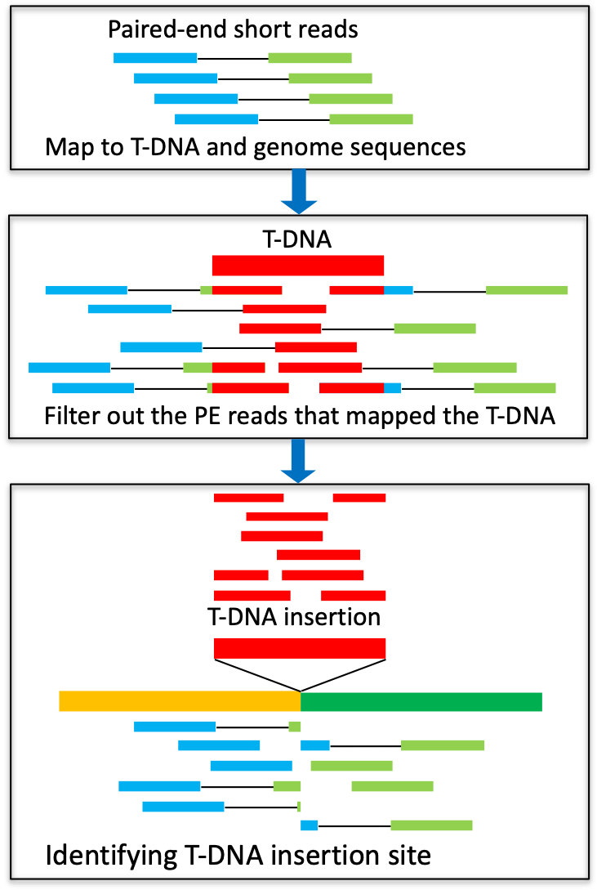

# T-DNA_Insertion_Identify
## Identifying T-DNA insertion site(s) by whole-genome resequencing
## 利用重测序技术鉴定 T-DNA 插入位点
The availability of T-DNA insertion sites is very important for functional genomics research and the screening and identification of transgenic. However, the present protocols for identifying T-DNA insertion sites, like reverse PCR and semi-random primer PCR, are not only complex and time-consuming, but also inefficient. In this GitHub, __`T-DNA_Insertion_Identify.sh`__  established a simple, reliable and efficient method for obtaining T-DNA insertion sites in transgenic.</br></br>

## License
__`Academic users`__ may download and use the application free of charge according to the accompanying license.</br>
__`Commercial users`__ must obtain a commercial license from Xukai Li.</br></br>

## Getting started
Put __`T-DNA_Insertion_Identify.sh`__ and all Fastq files and T-DNA.fa genome.fa in a same dir, then run:</br>
```sh
sh T-DNA_Insertion_Identify.sh  T-DNA.fa  genome.fa
```
And the results in __`CandiT-DNA.T-DNA.txt`__ file are like this:
```
#Chr    Breakpoint_Start    Breakpoint_End     Break_Length
Chr1    Start: 5251250      End: 5251267       Length: 17
```

Then use IGV to see the sam and ref.fa files and check T-DNA Insertion Loci.
</br>



## Contact information
For any questions please contact xukai_li@sxau.edu.cn or xukai_li@qq.com </br>
